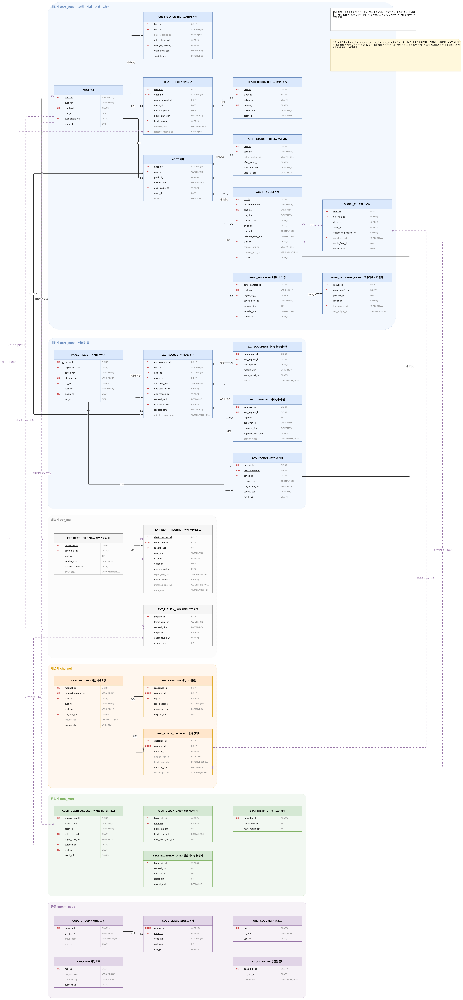

# 사망자 명의 금융거래 신속차단 시스템 — 데이터베이스 설계

**[📊 발표 자료 보기](https://Doo-Lee01.github.io/deceased-account-block-db/presentation.html)**     
**[✏️ 노션 페이지 보기](https://rhinestone-crafter-09e.notion.site/HOME-3dd49d7e6ffa805db933ff0284e0e2db?source=copy_link)**
**[💎 티스토리 보기](https://lxvxxu.tistory.com/210)**

금융위원회가 2026년 9월 11일부터 시행한 「사망자 명의 금융거래 신속차단 시스템」을 은행 관점의 데이터 모델로 구현한 프로젝트입니다.

## ERD



> 원본 파일: [`docs/logical-erd.drawio`](docs/logical-erd.drawio) — 탭 7개 (전체 · 조감도 · 계정계 · 예외인출 · 대외계 · 채널계 · 공통)
> [draw.io](https://app.diagrams.net)에서 열면 편집할 수 있습니다.


**MySQL 8.0 · 스키마 5개 · 테이블 30개 · FOREIGN KEY 67 · CHECK 41**

| 항목 | 내용 |
|---|---|
| 과목 | 데이터베이스 |
| 인원 | 2인 |
| 검증 환경 | MySQL 8.0.46 · InnoDB · utf8mb4 |
| 후속 계획 | Java 콘솔 애플리케이션 연동 |

---

## 목차

1. [빠른 시작](#1-빠른-시작)
2. [배경과 문제 정의](#2-배경과-문제-정의)
3. [구현 범위](#3-구현-범위)
4. [전체 구조](#4-전체-구조)
5. [설계 의사결정](#5-설계-의사결정)
6. [정규화](#6-정규화)
7. [법령 근거](#7-법령-근거)
8. [검증 결과](#8-검증-결과)
9. [파일 구성](#9-파일-구성)
10. [한계와 다음 단계](#10-한계와-다음-단계)

---

## 1. 빠른 시작

### MySQL Workbench (권장)

```
File → Open SQL Script → schema.sql → 번개(Execute) 버튼
File → Open SQL Script → seed_data.sql → 실행
File → Open SQL Script → validation_queries.sql → 실행
```

### Command Line Client

```sql
SOURCE C:/경로/schema.sql;
SOURCE C:/경로/seed_data.sql;
SOURCE C:/경로/validation_queries.sql;
```

> Windows 경로는 역슬래시(`\`)가 아니라 **슬래시(`/`)** 를 사용합니다.
> 한글이 깨지면 명령 프롬프트에서 `chcp 65001` 실행 후 `mysql -u root -p --default-character-set=utf8mb4`로 접속하세요.

### 설치 확인

```sql
SELECT table_schema, COUNT(*)
  FROM information_schema.tables
 WHERE table_schema IN ('comm_code','ext_link','core_bank','channel','info_mart')
 GROUP BY table_schema;
```

`comm_code 5 · ext_link 3 · core_bank 15 · channel 3 · info_mart 4`가 나오면 정상입니다.

`schema.sql`은 **재실행 가능**합니다. 첫 부분에서 기존 스키마를 모두 삭제하고 다시 만듭니다.

---

## 2. 배경과 문제 정의

기존에는 행정안전부의 사망자 정보가 **월 1회**, 그것도 일부 금융회사에만 제공되었습니다.
사망신고 기한 1개월과 합쳐지면 은행이 사망 사실을 알기까지 **최대 2개월**의 공백이 생깁니다.

그 사이 사망자 명의 계좌에서 인출과 이체가 계속 가능해 상속인 간 분쟁과 명의도용 범죄의 통로가 되었습니다.

개선 후에는 사망자 정보가 **매일 1회** 전 금융권에 제공되고, 사망신고 접수 **다음 날**부터 입금을 제외한 모든 거래가 차단됩니다.

### 제도를 DB 요구사항으로

| 제도 내용 | 모델에 반영한 것 |
|---|---|
| 매일 1회 정보 수신 | 파일 단위 + 레코드 단위 수신 이력 |
| 사망신고 **다음 날**부터 차단 | 차단개시일시 = 사망일이 아니라 **신고일 + 1일** |
| 입금 등 필수 거래만 허용 | 거래유형 × 방향을 **데이터로** 관리하는 규칙 테이블 |
| 치료비·장례비 예외 인출 | 신청–서류–승인–지급 상태 흐름 + 지정 수취처 |
| 자동이체 중단 | 약정과 처리결과 분리, 실패사유코드 기록 |
| 처리 이력의 전자적 기록·관리 | 감사로그 — 사망정보 **조회** 이력까지 포함 |

---

## 3. 구현 범위

### 범위 내

- 은행 1개사 · 입출금이 자유로운 예금 1종
- 사망정보 수신 → 고객·계좌 상태 반영 → 거래 차단 판정 → 예외 인출 → 감사·집계

### 범위 외와 제외 사유

| 제외 | 사유 |
|---|---|
| 카드·보험·증권 | 업권별 원장 구조가 상이해 모델 규모가 과도해짐 |
| 상속 분할·상속세 | 금융회사 시스템 밖의 업무(법원·세무) |
| 대출 원장 | 차단 대상 거래유형으로만 정의 |
| 금융공동망 고정길이 전문 | 참가기관 대상 비공개 규격 |
| 실제 행정안전부 API | 실습 환경에서 접근 불가. 샘플 파일 적재로 대체 |
| 화면·인증 | DB 과목 범위 밖. 채널계는 요청/응답 로그로만 표현 |

### 가정

| No | 가정 | 영향 |
|---|---|---|
| A-01 | 제공 정보에 사망일자와 **사망신고일자**가 모두 포함된다 | 차단개시일시 산출의 전제. 틀리면 제도가 성립하지 않음 |
| A-02 | 매칭 키는 (성명 + 실명확인번호)이며 해시로 비교한다 | 동명이인 오매칭 가능성 존재 → 해제 프로세스 필수 |
| A-03 | 차단은 **고객 단위**로 설정되고 보유 계좌 전체에 전파된다 | 차단 마스터의 주키가 계좌가 아닌 고객번호 |

---

## 4. 전체 구조

실제 은행은 역할에 따라 시스템을 나눕니다. 그 구조를 하나의 MySQL 서버 안에서 **데이터베이스(스키마)를 나누는 방식**으로 재현했습니다.

```
MySQL 서버 1대
 └─ 데이터베이스(스키마) 5개
     └─ 테이블 30개
```

| 스키마 | 계층 | 테이블 | 역할 |
|---|---|---|---|
| `ext_link` | 대외계 | 3 | 행안부·신용정보원에서 받은 데이터를 **가공 없이** 보관 |
| `core_bank` | 계정계 | 15 | 잔액과 거래를 **실제로 움직이는** 원장 |
| `channel` | 채널계 | 3 | 창구·ATM 요청을 받아 계정계에 전달, 결과 반환 |
| `info_mart` | 정보계 | 4 | 영업 종료 후 **일배치로 집계**. 개인식별정보 미보관 |
| `comm_code` | 공통 | 5 | 위 네 계층이 **모두 참조**하는 코드 정의 |

데이터가 흐르는 방향은 두 갈래입니다.

- **외부 → 대외계 → 계정계** — 사망정보가 들어와 차단이 생기는 경로
- **고객 → 채널계 → 계정계 → 정보계** — 거래가 처리되고 집계되는 경로

### 데이터가 쌓이는 순서

각 단계에서 어느 테이블에 행이 생기는지가 곧 그 테이블이 존재하는 이유입니다.

| | 일어나는 일 | 행이 생기는 곳 |
|---|---|---|
| 1 | 새벽 1시, 사망자 파일 수신 | `ext_death_file` `ext_death_record` |
| 2 | 해시로 고객 매칭 | `ext_death_record.match_status_cd` 갱신 |
| 3 | 차단 생성 (신고일+1일 00:00 산출) | `death_block` `death_block_hist` `cust_status_hist` `acct_status_hist` |
| 4 | 사망정보를 조회했다는 사실 | `audit_death_access` |
| 5 | ATM 출금 시도 → 차단 | `chnl_request` `chnl_block_decision` `chnl_response` |
| 6 | 타행에서 입금 → 허용 | `acct_txn` `acct.balance_amt` 갱신 |
| 7 | 자동이체일 도래 → 실패 | `auto_transfer_result` |
| 8 | 유가족이 장례비 신청 | `exc_request` → `exc_document` → `exc_approval` → `exc_payout` + `acct_txn` |
| 9 | 오매칭 판명 → 차단 해제 | `death_block` 갱신 `death_block_hist` `cust_status_hist` |
| 10 | 영업 종료 후 야간 집계 | `stat_block_daily` `stat_exception_daily` `stat_mismatch` |

거래 처리 중 **참조만** 하는 테이블: `block_rule` `payee_registry` `code_detail` `rsp_code` `org_code` `biz_calendar`

### 거래 한 건의 처리 순서

출금 요청이 들어오면 **세 곳을 읽어** 판정하고 **네 곳에 기록**합니다.

**읽기** — `ACCT`(예금주·잔액) → `DEATH_BLOCK`(차단중인가, 개시일시를 지났는가) → `BLOCK_RULE`(이 유형은 허용인가)

차단이 없으면 규칙은 조회하지 않습니다.

**쓰기** — `CHNL_BLOCK_DECISION`(항상, 허용도 기록) · `ACCT_TXN`(허용일 때만) · `ACCT.balance_amt`(허용일 때만) · `AUDIT_DEATH_ACCESS`(항상)

차단된 거래는 원장에 남지 않지만 판정이력과 감사로그에는 남습니다. 원장과 시도 이력을 분리한 이유입니다.

---

## 5. 설계 의사결정

### ① 차단 기준일은 사망일이 아니다

가족관계등록법 제84조에 따라 사망신고 기한은 1개월입니다. 사망일로 차단하면 아직 신고되지 않은 사망을 은행이 알 수 없어 제도가 성립하지 않습니다.

```sql
CONSTRAINT ck_block_start CHECK (
  block_start_dtm = TIMESTAMP(DATE_ADD(death_report_dt, INTERVAL 1 DAY))
)
```

애플리케이션이 아니라 **DB가 강제**합니다. 어떤 경로로 들어와도 틀린 차단 시각이 저장될 수 없습니다.

### ② 업무 규칙을 코드가 아닌 데이터로

"입금만 허용"을 `IF`문으로 하드코딩하면 규정이 바뀔 때 코드를 고치고 재배포해야 합니다. `block_rule` 테이블로 분리해 `UPDATE` 한 줄로 대응합니다.

| 거래유형 | 방향 | 허용 | 예외인출 | 응답코드 |
|---|---|---|---|---|
| DEP 입금 | I | Y | — | — |
| TRI 이체입금 | I | Y | — | — |
| WDR 출금 | O | N | 가능 | D001 |
| TRO 이체출금 | O | N | 가능 | D001 |
| ATO 자동이체 | O | N | 불가 | D002 |
| CLS 계좌해지 | O | N | 불가 | D003 |
| LON 대출실행 | O | N | 불가 | D004 |

규칙을 수정하지 않고 `apply_to_dt`로 **종료일을 끊고 새 행을 추가**합니다. 과거 판정의 근거가 보존됩니다.

규칙 자체의 무결성도 제약으로 지킵니다.

```sql
CONSTRAINT ck_rule_rsp_req CHECK (
  (allow_yn = 'Y' AND reject_rsp_cd IS NULL) OR
  (allow_yn = 'N' AND reject_rsp_cd IS NOT NULL)
)
```

허용인데 거절코드가 있으면 거래는 승인해 놓고 고객에게는 거절 메시지를 보내게 됩니다. 차단인데 거절코드가 없으면 왜 막혔는지 알려줄 수 없습니다. 둘 다 DB가 거부합니다.

### ③ 정책을 애플리케이션이 아니라 스키마로

지켜야 할 정책은 하나입니다. **예외인출 대금은 등록된 병원·장례식장으로만 나간다.**

보통은 애플리케이션 코드의 `if`문으로 막습니다. 문제는 DB에 들어오는 경로가 하나가 아니라는 것입니다.

| 경로 | 검증 코드를 거치나 |
|---|---|
| 창구 애플리케이션 | 거침 |
| 야간 배치 프로그램 | 다른 팀이 만듦 |
| 운영자의 DB 콘솔 | 코드를 안 거침 |
| 데이터 이관 스크립트 | 일회성이라 검증 생략 |

```sql
payee_id BIGINT NOT NULL,
CONSTRAINT fk_expay_payee FOREIGN KEY (payee_id)
  REFERENCES payee_registry (payee_id)
```

`NOT NULL`과 `FOREIGN KEY`를 **함께** 걸어야 합니다. NULL은 FK 검사를 통과하기 때문입니다.

어느 경로로 들어오든 DB 엔진이 거절합니다. 상속인 개인계좌 번호가 들어갈 자리 자체가 스키마에 없습니다.

```
ERROR 1452 (23000): Cannot add or update a child row:
  a foreign key constraint fails (`core_bank`.`exc_payout`,
  CONSTRAINT `fk_expay_payee` FOREIGN KEY (`payee_id`)
  REFERENCES `payee_registry` (`payee_id`))
```

### ④ 계층 경계에서는 FK를 걸지 않는다

전체 67개 FK 중 아래 6개만 의도적으로 제외했습니다.

| 관계 | 사유 |
|---|---|
| `ext_death_record` → `cust` | 대외계 원천을 재적재·정리할 때 계정계가 막히면 안 됨 |
| `ext_death_record` → `death_block` | 동일 |
| `chnl_request.acct_no` | **존재하지 않는 계좌번호로 온 요청도 기록**되어야 함. FK를 걸면 공격 시도를 추적할 수 없음 |
| `audit_death_access.target_cust_no` | 감사로그는 대상이 사라져도 남아야 함 |
| `chnl_block_decision.applied_rule_id` | 규칙이 폐기돼도 과거 판정 이력은 보존 |
| `block_rule` → `acct_txn` | 판정 시점의 참조. 규칙 폐기 후에도 과거 거래는 존재 |

### ⑤ 이력은 9999-12-31로 닫는다

고객 상태가 바뀔 때마다 기존 행을 남기고 새 행을 추가하는 SCD Type 2 방식입니다.

```sql
valid_to_dtm DATETIME(3) NOT NULL DEFAULT '9999-12-31 23:59:59.999',
UNIQUE KEY uk_cust_hist_current (cust_no, valid_to_dtm)
```

종료값을 NULL이 아니라 센티널로 둔 **진짜 이유는 UNIQUE 제약**입니다. MySQL의 UNIQUE는 NULL을 서로 다른 값으로 취급해 중복을 허용합니다. NULL이면 "현재 행"이 여러 개여도 막히지 않습니다.

> **운영 주의** — 상태를 바꿀 때는 기존 현재행을 먼저 닫아야 합니다.
> ```sql
> UPDATE cust_status_hist SET valid_to_dtm = NOW(3)
>  WHERE cust_no = ? AND valid_to_dtm = '9999-12-31 23:59:59.999';
> INSERT INTO cust_status_hist (...) VALUES (...);
> ```
> 순서를 바꾸면 UNIQUE 위반이 납니다. 이것이 정상 동작입니다.

`close_dt`처럼 "구간의 끝"이 아니라 "사건의 발생 여부"를 뜻하는 컬럼은 NULL이 맞습니다. 센티널을 넣으면 평균 존속기간 같은 집계가 왜곡됩니다.

### ⑥ 복합키 코드표에 외래키 걸기

`code_detail`의 기본키는 `(group_cd, code_cd)` 두 컬럼입니다. `10`이라는 코드값이 고객상태 그룹에도 예외인출사유 그룹에도 있어 코드값만으로는 유일하지 않기 때문입니다.

그런데 `cust` 테이블에는 `group_cd`가 없습니다. 외래키는 부모의 기본키 **전체**를 가리켜야 하므로 걸 수 없습니다.

```sql
cust_status_cd  CHAR(4) NOT NULL,
cust_status_grp CHAR(10) GENERATED ALWAYS AS ('CUST_ST') STORED,

CONSTRAINT fk_cust_status FOREIGN KEY (cust_status_grp, cust_status_cd)
  REFERENCES comm_code.code_detail (group_cd, code_cd)
```

`cust_status_grp`는 항상 `'CUST_ST'`가 되는 생성컬럼입니다. MySQL이 자동으로 채우므로 `INSERT`에 쓰지 않습니다.

**얻은 것** — 존재하는 코드인지뿐 아니라 **이 컬럼에 맞는 그룹의 코드인지**까지 막습니다. 고객상태 컬럼에 예외인출 상태값 `REQ`를 넣으면 거부됩니다. 단일 FK나 CHECK로는 불가능한 검증입니다.

**지불한 비용** — 생성컬럼 35개 추가, FK마다 인덱스 자동 생성, 생성컬럼에 걸린 FK는 `CASCADE` 사용 불가.

### ⑦ 규제 요건을 컬럼으로

| 법령 요건 | 반영 |
|---|---|
| 개인정보보호법 제24조의2 | `rrn_hash CHAR(64)` 검색용 + `rrn_enc VARBINARY(128)` 저장용 **분리** |
| 전자금융거래법 제22조 | `terminal_id` 등 거래 추적에 필요한 법정 기록 항목 |
| 신용정보법 제20조의2 | `cust.close_dt` — 보존기간 5년의 기산점 |

**채택하지 않은 것 — 연 단위 파티셔닝**

보존연한 관리에는 유리하지만 MySQL InnoDB는 파티션 테이블에 FK를 걸 수 없습니다.

```
ERROR 1506 (HY000): Foreign keys are not yet supported in conjunction with partitioning
```

거래원장에 FK가 5개 걸려 있어 파티셔닝을 택하면 참조 무결성을 전부 포기해야 합니다. 본 프로젝트는 **참조 무결성을 택하고** 보존기간 관리는 아카이브 테이블 이관으로 대체했습니다.

### ⑧ 삭제는 전부 RESTRICT

`ON DELETE CASCADE`를 쓰지 않았습니다. 금융 데이터는 지우는 것이 아니라 상태를 바꾸는 것이고, 실수로 고객 한 명을 지웠을 때 거래원장까지 연쇄 삭제되면 복구가 불가능합니다.

---

## 6. 정규화

30개 테이블 전부 **제3정규형**을 만족합니다.

| 단계 | 제거 대상 | 실제로 한 일 |
|---|---|---|
| 1NF | 다중값·반복 속성 | 증빙서류를 `exc_document`로, 승인을 `exc_approval`로 분리해 한 건당 한 행 |
| 2NF | 부분 함수 종속 | 복합키는 `code_detail(group_cd, code_cd)` 하나뿐이며 `code_nm`은 두 컬럼이 모두 있어야 결정됨 |
| 3NF | 이행 함수 종속 | 기관명·코드명·응답메시지를 원장에 두지 않고 **코드만 저장**해 조인 |
| BCNF | 비후보키 결정자 | 모든 결정자가 후보키. 별도 조치 불필요 |

30개 중 12개가 정규화 과정에서 분리된 테이블입니다. 이력 3종, 예외인출 4종, 코드 5종.

### 의도적 반정규화 3건

이유는 두 가지뿐입니다. **조회 성능**과 **판정 시점의 값 고정**.

| 컬럼 | 이유 | 내용 | 대가 |
|---|---|---|---|
| `acct.balance_amt` | 성능 | 거래원장 합계로 구할 수 있으나 20년치가 쌓이면 잔액 조회 한 번에 수만 행을 훑어야 함 | 잔액–원장 대사 쿼리 필요 |
| `acct_txn.balance_after_amt` | 시점 | 그 거래 직후의 잔액을 재계산 없이 답하기 위해. 오픈뱅킹 거래내역조회 API 응답 필드와도 일치 | 원장 수정 시 재계산 |
| `death_block.death_report_dt` | 시점 | 원천이 정정·재전송돼도 판정에 실제로 쓴 값은 바뀌면 안 됨 | 원천과 불일치 가능 |

**판단 기준** — 아래를 모두 만족할 때만 허용했습니다.
① 조회가 쓰기보다 훨씬 잦은가 ② 재계산 비용이 데이터 증가에 비례하는가 ③ 어긋남을 검증할 방법이 있는가

> 보안이나 교차검증이 목적이 아닙니다. 중복을 만들었기 때문에 어긋날 위험이 생겼고, 그래서 대사 쿼리가 **필요해진** 것입니다.
>
> `payee_id`가 `exc_request`와 `exc_payout` 양쪽에 있는 것은 반정규화가 아닙니다. 하나는 "신청 시 지정한 수취처", 다른 하나는 "실제 지급한 수취처"로 **의미가 다른 별개 컬럼**입니다.

---

## 7. 법령 근거

국가법령정보센터 현행본에서 조문을 확인해 반영했습니다.

| 축 | 근거 법령 | 모델 반영 |
|---|---|---|
| 기준정보 | 가족관계등록법 제84조·제85조 | `death_dt`와 `death_report_dt` 분리, 차단 기준을 신고일+1일로 확정 |
| 개념·논리 | 민법 제997조·제998조의2·제1000~1003조 | 예외인출 엔터티 도출, 신청인 자격을 법정 상속순위로 제한 |
| 물리 스키마 | 전자금융거래법 제22조·시행령 제12조, 개인정보보호법 제24조의2 | 법정 필수 컬럼 배치, 보존연한 확정, 해시·암호문 분리 |
| 업무 규칙 | 금융실명법 제3조·제4조 | 규칙 테이블 분리, 오매칭 권리구제 이력, 수취처 직수령 금지 |
| 검증·감사 | 전자금융감독규정 제13조 | 접근 감사로그에 조회 주체·목적·성공여부 강제 저장 |

**금융실명법 제3조 제5항** — 실명이 확인된 계좌의 자산은 명의자의 소유로 추정됩니다. 동명이인 오매칭으로 생존 고객이 차단되면 이 권리가 침해되므로, 차단 해제는 선택이 아니라 **권리 구제 절차**입니다.

**금융실명법 제4조** — 상속 절차가 완료되기 전까지 상속인은 법적으로 제3자입니다. 예외인출금을 상속인 개인계좌로 지급하면 비밀보장 원칙과 충돌합니다. 이것이 `payee_registry` FK의 근거입니다.

**전자금융거래법 시행령 제12조** — 건당 1만원 초과 거래는 5년, 1만원 이하는 1년 보존입니다. 같은 테이블 안에서 행마다 보존기간이 달라 일괄 삭제가 불가능하며, 파기 대상 선정에 금액 조건이 들어가야 합니다.

---

## 8. 검증 결과

### 업무 시나리오 — `validation_queries.sql`

샘플 데이터는 고객 5명의 이야기로 구성했습니다.

| 고객 | 상황 |
|---|---|
| 김정상 | 생존 — 대조군, 자동이체 정상 실행 |
| **박순자** | 09-12 신고 → 차단, 예외인출 2건(승인 1·반려 1) |
| 이영희 ×2 | 동명이인·동일 생년월일 → **다건매칭** 유발 |
| **최말순** | 오수신으로 차단 → 09-15 **해제** → 이후 정상 거래 |

**경계값** — 같은 계좌에서 같은 금액을 1분 차이로 요청

| 요청일시 | 시점 | 판정 | 응답 |
|---|---|---|---|
| 2026-09-12 23:59:00 | 차단개시 전 | 허용 | `0000` |
| 2026-09-13 00:00:01 | 차단개시 후 | 차단 | `D001` |

**무결성**

| 검증 | 확인하는 것 | 결과 |
|---|---|---|
| 잔액 = 원장 합계 | 반정규화한 `balance_amt`가 거래원장 입출금 합계와 같은가 | 5개 계좌 전부 일치 |
| 이력 현재행 | 고객마다 "지금 유효한 상태" 행이 정확히 1건인가 | 5명 전부 1건 |
| 유효구간 연속성 | 앞 행의 종료와 뒤 행의 시작이 맞물리는가 | 단절·중복 없음 |

유효구간에 틈이 있으면 그 시점의 상태를 알 수 없고, 겹치면 상태가 두 개가 됩니다. 둘 다 없어야 "임의의 시점 T에 이 고객이 차단 상태였는가"에 **답이 정확히 하나** 나옵니다.

### 제약조건 — `constraint_tests.sql`

일부러 잘못된 데이터를 넣어 DB가 막는지 확인합니다. **12건 중 11건이 거부되고 10번만 성공하면 정상**입니다. 오류가 나야 정상인 테스트라 **`--force` 옵션이 필요**합니다.

```
mysql -u root -p --force < constraint_tests.sql
```

| # | 시도 | 결과 | 막은 장치 |
|---|---|---|---|
| 1 | 공통코드에 없는 코드값 | 거부 `1452` | FK |
| 2 | **다른 그룹의 코드값**을 고객상태로 | 거부 `1452` | 복합 FK |
| 3 | 차단개시일시를 신고일 **당일**로 | 거부 `3819` | CHECK |
| 4 | 한 고객에게 차단 2건 | 거부 `1062` | UNIQUE |
| 5 | 거래금액 음수 | 거부 `3819` | CHECK |
| 6 | 입출금구분에 `X` | 거부 `3819` | CHECK |
| 7 | 없는 고객의 계좌 개설 | 거부 `1452` | FK |
| 8 | 허용 규칙에 거절코드 지정 | 거부 `3819` | CHECK |
| 9 | **미등록 수취처로 예외인출 지급** | 거부 `1452` | FK |
| 10 | 등록된 수취처로 지급 | **성공** | — |
| 11 | 같은 신청에 두 번째 지급 | 거부 `1062` | UNIQUE |
| 12 | 이력 현재행 2건 등록 | 거부 `1062` | UNIQUE |

| 오류번호 | 의미 |
|---|---|
| `1452` | FK 위반 — 부모 테이블에 없는 값 |
| `1062` | UNIQUE 위반 — 중복 |
| `3819` | CHECK 위반 — 조건 불충족 |

---

## 9. 파일 구성

```
.
├─ README.md                  설계 의사결정 보고서 (이 문서)
├─ data-dictionary.xlsx       데이터 사전 — 7개 시트
├─ schema.sql                 DDL 스크립트 — 스키마·테이블·제약·인덱스·코드
├─ seed_data.sql              테스트 데이터셋 — 고객 5명 시나리오
├─ validation_queries.sql     비즈니스 검증용 쿼리 14종
├─ constraint_tests.sql       제약조건 위반 테스트 12종 (--force 필요)
│                             schema.sql 직후·seed_data.sql 이후 모두 실행 가능
└─ docs/
    ├─ conceptual-erd.drawio  개념 ERD
    ├─ logical-erd.drawio     논리 ERD — 7개 탭
    └─ presentation.html      발표 자료
```

### data-dictionary.xlsx 시트 구성

| 시트 | 내용 |
|---|---|
| 개요 | 프로젝트 요약과 통계 |
| 테이블 목록 | 30개 테이블의 한글명·구분·기본키·**존재 이유** |
| 컬럼 정의 | 321개 컬럼의 자료형·NULL·키·FK 참조·설명 |
| 제약조건 | PK/UNIQUE/FK/CHECK 전체 목록과 정의식 |
| 인덱스 | 인덱스 목록과 구성 컬럼 |
| 공통코드 | 그룹 24개와 코드값 79개 |
| 표준 도메인 | 자료형 선택 기준과 명명 규칙 |

### docs/presentation.html

발표 자료입니다. 인터넷 없이 브라우저에서 바로 열립니다.

| 키 | 동작 |
|---|---|
| ← → · Space | 슬라이드 이동 |
| **F** | 전체화면 |
| **N** | 발표 노트 |
| **M** | 목차 |
| **E** | **ERD 탐색기** — 스키마 필터, 컬럼 검색, FK 출처 추적 |

점선 밑줄이 있는 용어를 클릭하면 상세 설명이 열립니다(65개).

---

## 10. 한계와 다음 단계

### 설계의 전제

행정안전부 제공 정보에 **사망신고일자가 포함된다**고 가정했습니다. 실제 규격을 확인할 수 없었고, 이 가정이 틀리면 제도 자체가 성립하지 않습니다.

### 매칭의 한계

해시 기반 매칭은 동명이인을 구분하지만, 원천에 주민번호가 없으면 성명·생년월일로 다건매칭이 발생합니다. 잘못 차단하면 생존 고객의 금융거래가 막히므로 자동 차단하지 않고 `match_status_cd = '40'`으로 분리해 수작업 확인 대상으로 둡니다.

### 다음 단계

- 배치 프로시저 — 사망정보 매칭에서 차단 생성까지
- 판정 로직을 Java 서비스 계층으로 이관
- 로그 보존기간 확정과 아카이브 이관 설계

판정 로직을 프로시저에 두껍게 넣지 않았습니다. **규칙은 테이블에, 조합과 분기는 서비스 계층에** 두는 구조라 Java 이관이 수월합니다.

### 평가 기준별 요약

| 항목 | 내용 |
|---|---|
| 정규화 | 3NF 만족, 반정규화 3건은 근거와 대가 명시 |
| 참조 무결성 | FK 67개. 미설정 6개는 사유 문서화 |
| 도메인 무결성 | CHECK 41개, 공통코드 FK로 코드값 강제 |
| 이력 관리 | SCD Type 2, 현재행 유일성을 UNIQUE로 보장 |
| 검증 | 업무 시나리오 14종 + 제약 위반 12종, MySQL 8.0.46에서 실행 확인 |
